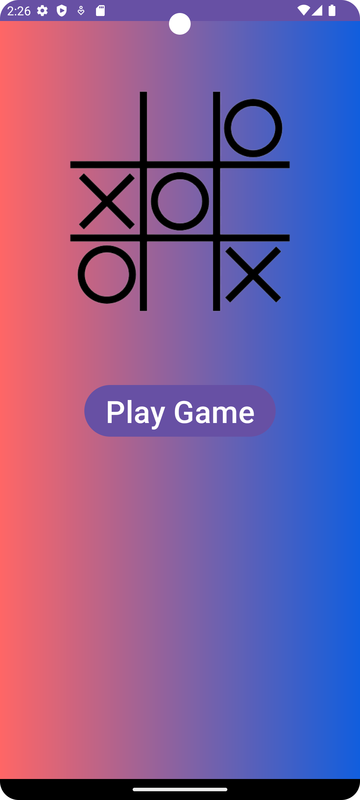
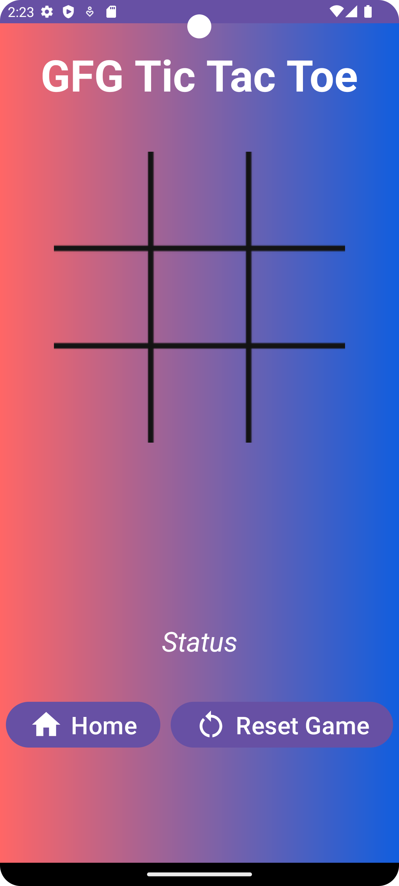
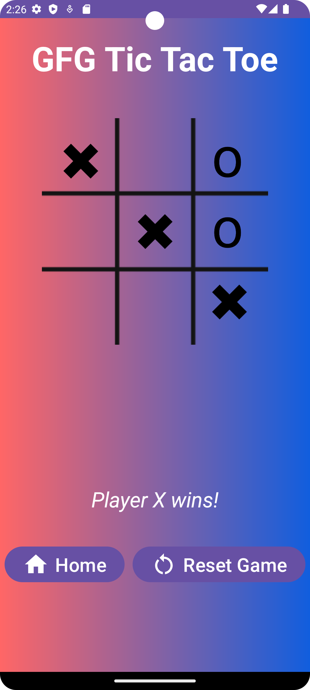
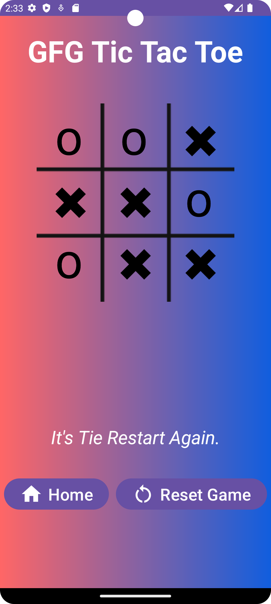

# TicTacToeGame

## Project Name: TicTacToeGame

## Description
TicTacToeGame is a simple Android application designed for playing the classic game of Tic Tac Toe. It offers a user-friendly interface that allows two players to take turns, placing X and O symbols on a grid, and it includes the functionality to reset the game and return to the home screen.

## Components
- **MainActivity**: This is the main activity of the app, serving as the entry point for users. It provides navigation to the game activity.

- **GameActivity**: The core of the game logic and user interface resides here. Players can enjoy the Tic Tac Toe game, taking turns to place their respective symbols on the grid.

- **Layouts**: The project contains XML layout files that define the user interface for both the main activity and the game activity. These layouts ensure an appealing and interactive experience for players.

- **Drawables**: The "drawables" folder holds image resources for X and O symbols, enhancing the visual aspect of the game.

## Functionality
- Players can engage in the classic game of Tic Tac Toe, taking turns to place their symbols on the grid.
- The app provides a reset feature, allowing players to clear the grid and start a new game.
- A "Home" button enables users to return to the main screen for navigation and convenience.

Enjoy your games of Tic Tac Toe with the TicTacToeGame app!

## Screenshots

## Installation
To install and run this app, follow these steps:
1. Clone the repository to your local machine.
2. Open the project in Android Studio.
3. Build and run the app on an Android emulator or physical device.

## Contributors
- Makwana Swastik

If you would like to contribute to this project, please open an issue or submit a pull request.

Happy gaming!
